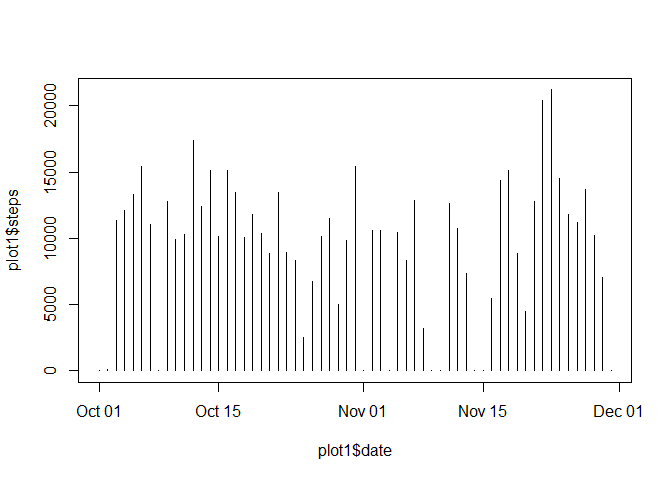
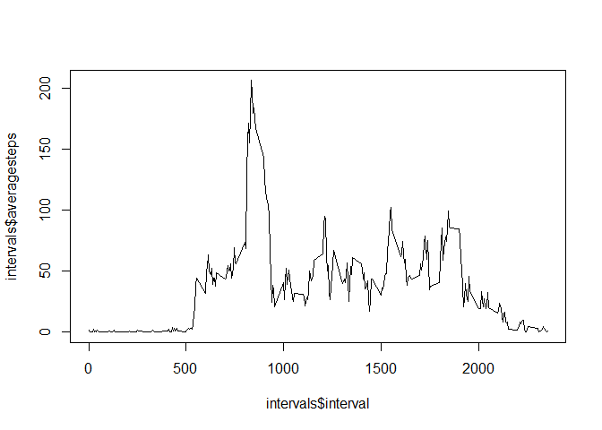
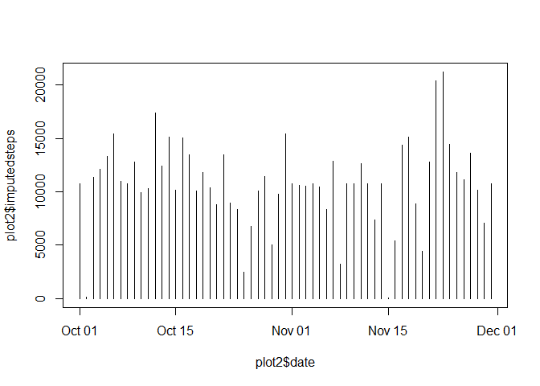
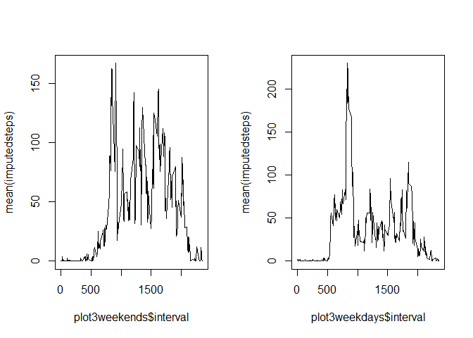

# ReproducibleResearch_CourseProject1
ScottFitzpatrick  
June 16, 2016  


# Loading and prepocessing the data

First, read in the raw data and convert the date variable to date type.


```r
# load data
data <- read.csv("activity.csv")
# convert to date type
data$date <- as.Date(data$date)
```


# What is mean total number of steps taken per day?

Make a histogram of the total number of steps taken each day


```r
# aggregate total number of steps taken each day
library(dplyr)
plot1 <- data %>% select(date, steps) %>% group_by(date) %>% summarise(steps = sum(steps, na.rm = TRUE))
# plot the output in a histogram
plot(plot1$date, plot1$steps, type = "h")
```

\

Calculate and report the mean and median total number of steps taken per day


```r
mean(plot1$steps)
```

```
## [1] 9354.23
```


```r
median(plot1$steps)
```

```
## [1] 10395
```


# What is the average daily activity pattern?

Make a time series plot of the 5-minute interval and the average number of steps taken, averaged across all days


```r
# calculate the average number of steps for each interval
intervals <- data %>% group_by(interval) %>% summarise(averagesteps = mean(steps, na.rm = TRUE))
# plot the output in a line plot
plot(intervals$interval, intervals$averagesteps, type = "l")
```

\

Which 5-minute interval, on average across all the days in the dataset, contains the maximum number of steps?


```r
intervals %>% arrange(desc(averagesteps))
```

```
## Source: local data frame [288 x 2]
## 
##    interval averagesteps
##       (int)        (dbl)
## 1       835     206.1698
## 2       840     195.9245
## 3       850     183.3962
## 4       845     179.5660
## 5       830     177.3019
## 6       820     171.1509
## 7       855     167.0189
## 8       815     157.5283
## 9       825     155.3962
## 10      900     143.4528
## ..      ...          ...
```


# Imputing missing values

Note that there are a number of days/intervals where there are missing values (coded as NA). The presence of missing days may introduce bias into some calculations or summaries of the data.

Calculate and report the total number of missing values in the dataset (i.e. the total number of rows with NAs)


```r
nrow(filter(data, is.na(steps)))
```

```
## [1] 2304
```

Devise a strategy for filling in all of the missing values in the dataset.


```r
# add column that includes average steps for each interval
data <- data %>% group_by(interval) %>% mutate(intervalaverage = mean(steps, na.rm = TRUE)) %>% ungroup()
# add imputed column that fills in missing steps values with the average for that interval
data <- data %>% mutate(imputedsteps = ifelse(is.na(steps), intervalaverage, steps))
```

Make a histogram of the total number of steps taken each day


```r
# aggregate total number of steps taken each day
plot2 <- data %>% select(date, imputedsteps) %>% group_by(date) %>% summarise(imputedsteps = sum(imputedsteps, na.rm = TRUE))
# plot the output in a histogram
plot(plot2$date, plot2$imputedsteps, type = "h")
```

\

Calculate and report the mean and median total number of steps taken per day


```r
mean(plot2$imputedsteps)
```

```
## [1] 10766.19
```


```r
median(plot2$imputedsteps)
```

```
## [1] 10766.19
```

Imputing the missing data increases the mean and median number of steps per day.


# Are there differences in activity patterns between weekdays and weekends?

Create a new factor variable in the dataset with two levels -- "weekday" and "weekend" indicating whether a given date is a weekday or weekend day.


```r
# create 'weekday' and 'dayclass' fields
data <- data %>% mutate(weekday = weekdays(date)) %>% mutate(dayclass = ifelse((weekday == "Saturday" | weekday == "Sunday"), "weekend", "weekday"))
```

Make a panel plot containing a time series plot of the 5-minute interval (x-axis) and the average number of steps taken, averaged across all weekday days or weekend days (y-axis).


```r
# calculate average number of steps taken across 5-minute intervals for both weekends and weekdays
plot3 <- data %>% group_by(interval, dayclass) %>% summarise(mean(imputedsteps))
plot3weekends <- plot3 %>% filter(dayclass == "weekend")
plot3weekdays <- plot3 %>% filter(dayclass == "weekday")
# plot the results
par(mfrow = c(1, 2))
plot(plot3weekends$interval, plot3weekends$`mean(imputedsteps)`, type = "l", ylab = "mean(imputedsteps)")
plot(plot3weekdays$interval, plot3weekdays$`mean(imputedsteps)`, type = "l", ylab = "mean(imputedsteps)")
```

\
